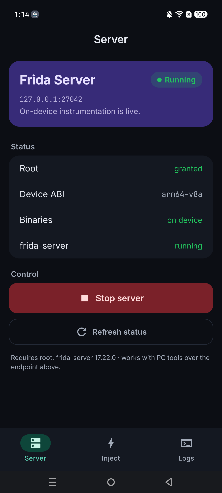
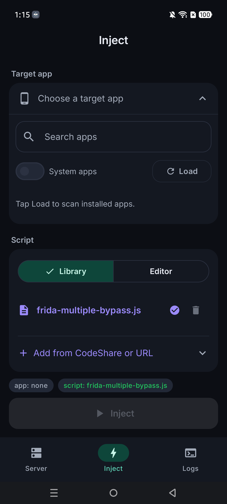
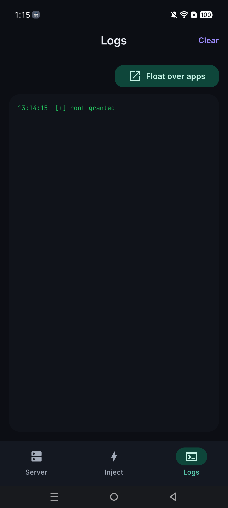

# FridaGo

On-device [Frida](https://frida.re) control for rooted Android — run `frida-server`, pick a target app, pick or write an agent script, and inject, all from the phone. No PC required.

Built with Jetpack Compose + Material 3. Ships with Frida **17.22.0** and auto-migrates older CodeShare scripts to the Frida 17 API.

---

## Screenshots

| Server | Inject | Logs |
|:---:|:---:|:---:|
|  |  |  |

---

## Features

- **One-tap server** — downloads the matching `frida-server` for your ABI on first start, flips SELinux permissive, and runs it detached on `127.0.0.1:27042`. Live status for root, ABI, binaries and server.
- **One-screen inject flow** — choose a target app (searchable, with icons), pick a script from your library or write one in the built-in editor, then **Inject**. Spawns the target under instrumentation.
- **Script sources** — search **Frida CodeShare** by keyword and import with a tap, or pull any script from a **GitHub** / **Gist** URL. Everything lands in your local library.
- **Floating logs** — pop the log stream into a draggable overlay window that stays on top of the app you inject into. Color-coded, live, survives backgrounding. Auto-opens on inject.
- **Frida 17 ready** — scripts written against the old `Java` global are auto-wrapped with `frida-java-bridge` and a legacy-API shim at inject time.
- **Polished UI** — Inter + JetBrains Mono, violet/mint dark theme, adaptive icon, launch-time permission gate.

---

## Requirements

- A **rooted** Android device (Magisk / KernelSU). `su` is requested the first time you start the server.
- Android 7.0+ (minSdk 24). Tested on `arm64-v8a`.
- Internet access for the first binary download and for importing scripts.

---

## Build

```bash
git clone https://github.com/imtaqin/FridaGo.git
cd FridaGo
./gradlew installDebug
```

Or open the project in Android Studio and hit **Run**. Package id: `com.imtaqin.fridago`.

---

## Usage

1. **Server tab** → *Start server*. Grant `su` when Magisk prompts. Wait for `frida-server` → `running`.
2. **Inject tab** → choose a target app → pick a script from the library (or **Add from CodeShare / URL**, or write one in **Editor**) → **Inject**.
3. **Logs tab** → watch output, or tap **Float over apps** to keep it visible while you drive the target app.

Because the server listens on `127.0.0.1:27042`, you can also attach from a PC over `adb forward tcp:27042 tcp:27042` and use `frida` / `frida-trace` as usual — just keep the client on Frida 17.x to match.

---

## Disclaimer

FridaGo is for **authorized** security research, app analysis, debugging and education on devices and apps you own or have explicit permission to test. You are responsible for how you use it.

## License

No license yet — all rights reserved by the author until one is added.
